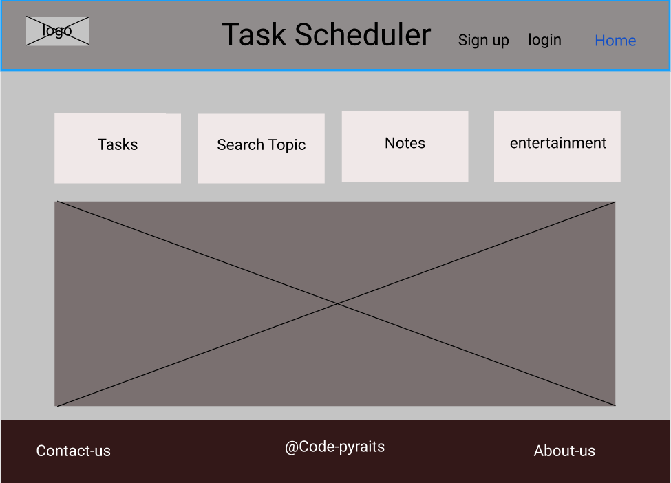

# Task Scheduler

## Team Name: codepyrate

### Team members:
  * Murad Alkhatib
  * Mona Salih
  * Khaled Alqrainy
  * Suzan Hiary

## Idea Description:

This program acts as a personal assistant, the user should be able to either add reminders or to select from a list of tasks that can also be scheduled. This programme helps people manage tasks and can operate directly on the system as user command

--- 
## [Software Requirements](https://github.com/Codepyrate/task-scheduler/blob/develop/software-requirements.md)
## [Trello Board](https://trello.com/b/eigIzOvr/task-scheduler)
## wireframe

## User Stories

### 1. Reminders

As a user I want to set reminders so that I don’t miss the tasks I plan to do.

#### Feature Tasks

1. The user can type a message in the reminder which will get shown once the alarm goes off.

    * given [the user set message for reminder]

    * when [user typeds the message]

    * then [message saved]

2. The user can set the time for the alarm.

    * given [the user set alarm for message]

    * when [user choose time to start the task]

    * then [alarm saved]

3. The user can save or cancel the reminder while setting it up..

    * given [user can save/delete reminder]

    * when [user choose to save task/ delete]

    * then [save/delete]

4. The user can dismiss the alarm once it goes off.

    * given [user can dismiss alarm]

    * when [user can close the alarm]

    * then [dismiss alarm(didnt show again)]

5. The user can modify the details of the reminders as long as they are not due yet.

    * given [user can change on reminder details]

    * when [can change time/ task type/ message]

    * then [save new change and show it at due time]

#### Acceptance Tests

1. Ensure that the alarm goes off at the specified time.
2. Ensure that the reminder shows the entered message.
3. Ensure that the alarm is dismissed when the user does so.

### 2. Note Taking

As a user I want to add notes and view them.

#### Feature Tasks

1. The user can view the notes he added before.

    * given [user can show the note]

    * when [read the note at due time or when he update the task]

    * then [note appears clearly on a task description]

2. The user can add new notes.

    * given [user can add new note to task discription]

    * when [can update task note]

    * then [saved new adds]

3. The user can modify the title or the content of the notes.

    * given [user can update note detalis such as title and contant]

    * when [can update task details]

    * then [saved new update]

4. The user can mark some notes as important so that they appear on top of other notes in the index.

    * given [user can mark important note]

    * when [choose important note]

    * then [important note will dispaly at the top]

5. The user can search for the note by keyword.

    * given [user can set keyword for note]

    * when [choose keyword]

    * then [all the note connect to keyword will appear on user search]

6. The user can export notes as files of various supported formats.

    * given [user can export note as file]

    * when [export note as file]

    * then [can show note as format file]

#### Acceptance Tests

1. Ensure that the most important notes appear first.
2. Ensure that the user can view and modify notes without any issues.
3. Ensure that searching by keywords returns the note that contains that keyword or part of it.
4. Ensure the exporting notes yields working files.

### 3. Topic Search

As a user I want to search for a topic and see a list of articles from a set of sites so that I can either read them directly , or save them for later in my notes, or set a reminder to read them later.

#### Feature Tasks
1. The user can type the name of the topic and see a list of related articles.
 * Given [the user started the search app]
     * When [the user types the name of a topic and hits enter]
     * Then [a list of 5 articles from pre-selected websites will show up numbered]

2. The user can select or choose which article to read from the results.

     * Given [a numbered list of 5 articles is shown for the user]
     * When [the user types the number of the article and hits enter]
     * Then [The content of the article will get shown for the user]

3. The user can save articles in reminders to read them later locally.

     * Given [a numbered list of 5 articles is shown for the user]
     * When [the user selects to save the article to view it later]
     * Then [the reminder app will start to set the time and message for the reminder]

#### Acceptance Tests

1. Ensure the searching of a topic shows the user a number of titles for the articles that match.
2. Ensure that the index of the article opens the content of that article in the terminal.
3. Ensure that the article is saved for later if the user chooses to read later.

### 4. Entertainment

As a user  I want something simple to entertain me that does not interfere with my schedule.

#### Feature Tasks

1. The program can predict the time when the user is not busy with anything (idle).
2. The user expects some entertaining activities like playing music or a simple game.

    * Given [the user is idle or not busy]
    * When [the program detects the user is not busy or idle]
    * And [the feature is not turned off]
    * Then [a notification will pop up for the user asking them if they want to start an entertaining activity]
    ##

    * Given [a notification has popped up asking the user to approve starting an entertaining activity]
    * When [the user approves to start an entertaining activity]
    * Then [a random entertaining activity will start]

3. The user can dismiss or decline the proposed activity.

    * Given [a notification has popped up asking the user to approve starting an entertaining activity]
    * When [the user dismisses or declines starting a random entertaining app]
    * Then [notification is removed and the activity is killed]

4. The user can turn off this feature.

    * Given [the user is in the settings page]
    * When [the user turns off the entertainment feature]
    * Then [entertainment feature is turned off]

#### Acceptance Test

1. Ensure the program can expect the times when the use is not busy.
2. Ensure the feature gets turned off when the user does so.
3. Ensure the program will offer the user something entertaining or joyful.

## [Database Schema Diagram](https://lucid.app/lucidchart/2356a870-4895-48fb-8a24-23508b699be4/edit?viewport_loc=194%2C64%2C1912%2C861%2C0_0&invitationId=inv_050e3c0c-0b12-417f-926a-8556c37f9835)
